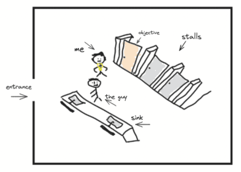

### Do people think of little things?

One early morning I went to this cafe that I usually visit, but first I wanted to use the bathroom inside so I headed there first. A few steps in and I saw someone moving towards the sink to wash their hands, in a matter of milliseconds and before I fully recognize them they said “hi”. 

Now, I was caught off guard. When I was getting near the bathroom I had one objective: transmit my urine to the toilet. I was walking with a relative above average speed and I was focused on entering to one of the stalls to conclude my objective, and in the meanwhile and as usual I was daydreaming about something else - like I should learn how to make tacos today - during the whole time. I did not expect anyone to be there. Who was he anyway?

As a consequence, I responded with a rushed “hi” immediately right before I recognize him. He’s the one working in the cafe. He’s one of the barista boys. He’s the one making my coffee. But at this point I was already walking and I had passed him a few inches where it would position him right behind me and there was no time for more intraction. Here’s a quick diagram of the situation:

As soon as I went inside the stall and started unzipping my pants, and as he was washing his hands, a thought appeared in my head out of nowhere. Is he thinking about me right now? Is he thinking to himself that this guy is losing liquids, I bet that he’s going to come and order coffee? 

I couldn’t stop smiling of the silliness of the thought, of thinking that him, a human being, an intelligent creature, ever actually think of something this small and insignificant and in case if it’s true, then something maybe even self-evident and obvious in the unconscious mind.

### The insignificant.

I’ve been following and reading a number of blogs lately. People write about in-depth life lessons, comprehensive business advices, stories of years of failures and successes, fairy tales, faith, technical posts where you need to open dozens of other articles, wikipedia pages and references to understand them.

You see, my last blog post was around 2 years ago, so I decided to see if I can I write one about one of most ordinary interactions ever that happened in a bathroom and the following the most nonsensical thought ever about it. 

That aside, the main thing for me though was this question that do people ever think about the tiny “unimportant” things that happen in life? Things that we do or repeat unconsciously everyday without ever noticing actually why or how we’re doing it? Things that we take for granted and forget about them because we are so carried away by our daily duties and routines.

I know the instance that I wrote about of course is the most obnoxious example one could make, (and yes I have tons of them) and could be even a bit unrelated, however, I also find observing carefully and being mindful on what we are doing or what is happening around us to be a form of meditation and a form of reminder of our place and role in the universe. The more trivial the thing, the greater the outcome.

The other day I came across this little poem named “the geometry of a sandwich” by Ron Padgett:

> "if you make a sandwich\
> using two pieces of traditional American sandwich bread\
> and slice it diagonally\
> you end up with two right triangles.\
> well, technically one of them is not a triangle,\
> since where its right angle should be\
> is rounded.
>
> look at the sandwich:\
> the two halves look different.\
> the difference is a very small thing to notice,\
> so small as to be useless\
> in the great rush of life.\
> I feel sorry for its smallness."

Now this poem somehow felt like home for me. Every now and then, I notice the small things of life. The wooden spatula that I’m cooking with, how is it made? How many years of evolution led to this point of time where I can just use it in my kitchen? Isn’t it wonderful that I can cook? That I can taste food? I feel sorry of the smallness for this wooden spatula. For the indifference around it. We both are small and lonely in the vastness of this universe. I won’t let it be forgotten. I feel happy for our existence. I care, I do.
