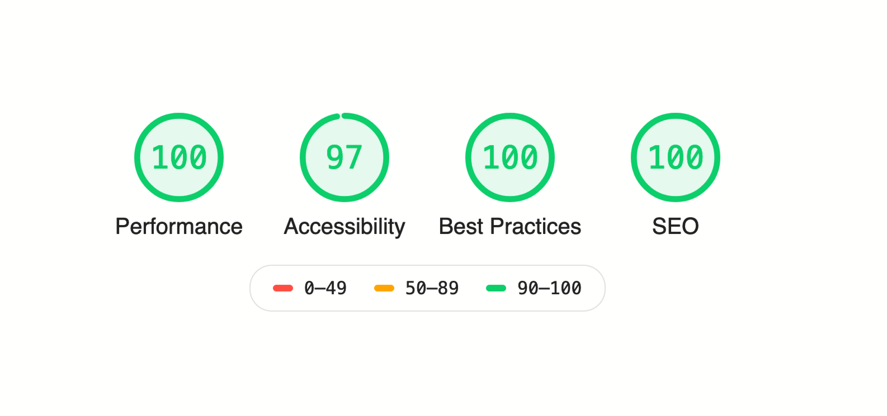

I've been working with React for the past 3 years or so, and after experimenting with various patterns and tools, I think I've found my favorite way of doing things. Things that make me go to bed without thinking, "why haven't I thrown my laptop off a cliff?".

These are solely based on my **personal experience**. I'm sure you can always find a better approach to solve every problem, but as of now, this is how I code React in 2020.

### No JavaScript.

...use [TypeScript](https://www.typescriptlang.org/) instead. 

The **IntelliSense** and the ability to inspect the code or catch errors without leaving my editor is quite nice. This allows me to **rewrite or refactor** my entire app with confidence and without a need to start the app or even go back and forth between browser and editor. I'd only start the app once I'm finished to find that it's working as expected with (almost) no issues.

The tooling for libraries and frameworks and the community around them is simply amazing. Many of them are moving to TypeScript these days or have a separate `@types` package that you can install.

```tsx
/* Modal.jsx */

interface Props {
  show: boolean;
  id?: string;
}

const Modal: FC<Props> = props => {
  // props.show -> boolean
  // props.id -> string | undefined
  // props.children -> ReactNode | undefined
}
```

There are some cases where I feel like it's bringing my development speed down with pointless errors on unnecessary types. In these situations, I don't really mind hack my way around it (I'd use `any` or something), because after all, these tools are meant to establish a good developer experience and not to keep them busy with things that don't eventually affect the end product.

### Components: long, and several.

And in one file. From the moment I opened my eyes to the world to this day, all I saw in React projects was one component per file and it never occurred to me to question the approach or think why. I just went with it. Well, no more.

Today my components are long, strong and healthy. I would only break them down into multiple components if they contain complex states, which in that case, I'm going to put them into the **same file**. I find it easier to search, navigate and develop in a single rather than multiple files in a folder.

```tsx
/* Page.jsx */

const M = () => {
  // states...
  return <div />
}

const E = () => {
  // states...
  return <div />
}

const Help = () => {
  return (
    <>
      <M />
      <E />
      { /* long jsx */ }
    </>
  )
}
```

### Flatter folder structure.

I used to create a folder for each component and inside that create file for the component and create an `index.ts` file to export that component. This kind of structure makes me only feel nice but in the long run it's not really practical. Finding, renaming, or even moving a single file is a more convenient than a folder and generally there is less **cognitive load** involved.

Now days I would only group components in a folder when I notice they are really connected to each other and makes sense to do so. Otherwise, one file ftw.

```text
├── components/
│		├── Settings/
│		│   ├── index.ts
│		│   ├── SettingsApi.tsx
│		│   ├── SettingsDomain.tsx
│		│   ├── SettingsPassword.tsx
│		├── Button.tsx
│		├── Footer.tsx
│		├── Header.tsx
│		├── Layout.tsx
│		├── Table.tsx
│		├── Text.tsx
├── store/
│		├── index.ts
│		├── settings.ts
│		├── store.ts
├── hooks.ts
├── utils.ts
```

### No Redux.

Although [Redux](https://redux.js.org) is not bad (ie. "I have been using it for too long it's now hard for me to confess it's bad"), with the introduction of **React Hooks** and the powerful libraries that came after, it's not really worth it anymore. Mostly because the amount of boilerplate needed for small changes, especially when used with **TypeScript**, it quickly becomes hell.

I use internal state hooks for the components and only use global state when data needs to be accessed in several places.

For the global state I have tried some libraries and I liked all of them but so far don't have a strong opinion on one because I tend to use internal state a lot more (I guess that's good?). Nonetheless, I'd usually choose one based on how well they support TypeScript and SSR.

```tsx
const VibeCheck = () => {
  const isAuthenticated = useStoreState(); // Global state
  const [loading, setLoading] = useState();
  const [config] = useContext(ConfigContext);	

  return <div />
}
```

### Tests.

...let's just move on.

### Boilerplates and SSR.

I'm using CRA, Next.js and Gatsby on different projects simultaneously. CRA is for when I only want to focus on the front-end and create an app (e.g. dashboard) which doesn't need to be rendered on the server-side. 

For any SSR my first pick is Next.js, it's incredibly simple and straightforward to work with. I can have my custom API, custom server, pages, routing and React app in one place, which is nice. [kutt.it](https://kutt.it/) and [tgdr.io](https://tgdr.io) are two important projects that I built with Next.js.

I use Gatsby to generate static websites and although I can do the same with Next.js, a generated website with Gatsby is very well optimised. The primary selling point for me is the plugin system and how they kinda act like middleware where I can add any functionality with just few lines of code.

Long story short, I hate webpack config and if I have to do it manually, I rather write jQuery.



### Styles.

My only approach is CSS-in-JS. I've been using [styled-components](https://styled-components.com) since day one. [Rebass](https://rebassjs.org/) and [theme-ui](https://theme-ui.com) is a deadly combination that allows me to create custom, themeable components where helper options like `padding`, `margin`, `flex`, etc. are added to each of them.

I'm planning to use [emotion](https://emotion.sh) in the future, mostly because the above libraries use emotion internally and I want to leverage the consistency and performance. Another reason is that I get weird type errors and conflicts, and I'd usually have to use a strict version to make sure everything compiles. Otherwise I'm gonna spend my day hitting my head on the desk.

```tsx
const Alert = styled(Flex)`
  ${ /* styles... */ }
`;

const Launch = () => {
  <Alert
    alignItems={["center", "flex-start"]}
    fontSize={[16, 18]}
    px={[2, 3, 3, 4]}
    m={2}
  >
    Group action in 5 minutes.
  </Alert>
}
```

### Debugging.

`console.log()`.

### Wrapping up.

I'm not sure if it's a sign of getting old or getting lazier, but at the end of the day I just want to get things done. Trying to abstract too much, writing the perfect config, deciding to whether use single quote or double quote and stuff like that may sound meaningful in short term but they distract me from my end goal which is building things I love.
