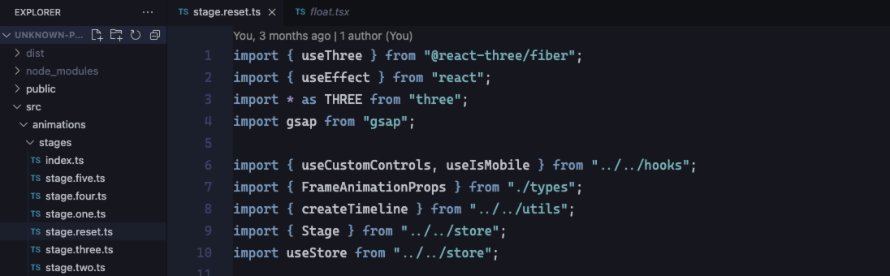

I'm not famous, and nobody has ever asked me what I use, however, I felt the urge to let everyone know about it. 

So let's start.

### Editor.

- [Visual Studio Code](https://code.visualstudio.com) has been my main code editor for the past ~3~ ~4~ +5 years.
- [Iceberg](https://marketplace.visualstudio.com/items?itemName=cocopon.iceberg-theme) is the main theme I use (with small customization; see below.)
- [Brackets Light Pro](https://marketplace.visualstudio.com/items?itemName=fehey.brackets-light-pro) for when I switch to light mode.
- [ｖａｐｏｒｗａｖｅ](https://marketplace.visualstudio.com/items?itemName=this-fifo.vaporwave-theme-vscode) as the backup theme.
- [Cascadia Code](https://github.com/microsoft/cascadia-code) font with ligatures enabled.

**Extensions:**

- [es6-string-html](https://marketplace.visualstudio.com/items?itemName=Tobermory.es6-string-html): Syntax highlighting for ES6 multiline strings.
- [TODO Highlight](https://marketplace.visualstudio.com/items?itemName=wayou.vscode-todo-highlight): Highlight TODO's in the code.
- [Toggle Quotes](https://marketplace.visualstudio.com/items?itemName=BriteSnow.vscode-toggle-quotes): Toggle between quotes and backticks.
- [vscode-shader](https://marketplace.visualstudio.com/items?itemName=slevesque.shader): Support for shader language.

**Other configurations:**

I've disabled the status bar, the activity bar, the minimap, breadcrumbs and basically any other visual noise if I ever notice them on my editor screen.

I've disabled TypeScript checks so I don't see errors. I don't format my code, and I don't have a formatter or a linter extension like prettier or eslint, because I don't want them to decide for me.

Here are some notable configurations:

```json
{
  "editor.fontSize": 15,
  "editor.lineHeight": 23,
  "editor.cursorWidth": 3,
  "editor.cursorBlinking": "phase",
  "editor.cursorSmoothCaretAnimation": true,
  "editor.minimap.enabled": false,
  "window.commandCenter": false,
  "breadcrumbs.enabled": false,
  "workbench.activityBar.visible": false,
  "workbench.statusBar.visible": false,
  "window.commandCenter": false,
  "workbench.layoutControl.enabled": false,
  "workbench.activityBar.location": "hidden",
  "editor.bracketPairColorization.enabled": false,
  "editor.formatOnSave": false,
  "javascript.validate.enable": false,
  "typescript.validate.enable": false
  // customize the iceberg theme to 
  // highlight function names and constants
  "editor.tokenColorCustomizations": {
    "[Iceberg]": {
      "textMateRules": [
        {
          "name": "entity function name",
          "scope": "entity.name.function",
          "settings": {
            "foreground": "#A093C7"
          }
        },
        {
          "name": "constant",
          "scope": "constant",
          "settings": {
            "foreground": "#A093C7"
          }
        }
      ]
    }
  },
}
```


### Applications.

- [1Password](https://1password.com/), manage passwords.
- Adobe [Premiere](https://www.adobe.com/products/premiere.html) and [After Effects](https://www.adobe.com/products/aftereffects.html), to make video.
- [Affinity Photo 2](https://affinity.serif.com/en-us/photo/), edit the photos I've taken with my camera.
- [Alfred 4](https://www.alfredapp.com), launcher, clipboard manager, scripts and more.
- [Amethyst](https://github.com/ianyh/Amethyst), I wasn't into window managers until I used this one.
- [Amphetamine](https://apps.apple.com/us/app/amphetamine/id937984704), keeping the display on for when needed.
- [Anki](https://apps.ankiweb.net/index.html), flashcards. I particularry use it for languages and words.
- [AppCleaner](https://freemacsoft.net/appcleaner/), uninstall apps and all of their data.
- [Arc](https://arc.net/), the main web browser I use.
- [Aural](https://github.com/kartik-venugopal/aural-player), music player.
- [Blender](https://www.blender.org/), 3D design software.
- [Cmder](https://cmder.app/), terminal when I'm on Windows.
- [Cyberduck](https://cyberduck.io/), FTP and SFTP client.
- [Dozer](https://github.com/Mortennn/Dozer/), hide status bar icons.
- [Figma](https://www.figma.com/), design interfaces.
- [Firefox](https://www.mozilla.org/en-US/firefox/developer/), my browser when I'm on Windows. 
- [f.lux](https://justgetflux.com/), kill that blue light at night. 
- [FUJIFILM X RAW STUDIO](https://fujifilm-x.com/en-us/support/download/software/x-raw-studio/), edit photos I've taken with my Fujifilm camera.
- [IINA](https://iina.io/), media player.
- [iTerm2](https://iterm2.com) + [Oh My Zsh](https://github.com/ohmyzsh/ohmyzsh), my default terminal.
- [MonitorControl](https://github.com/MonitorControl/MonitorControl), control external display's brightness.
- [Motrix](https://motrix.app/), download manager.
- [Muse](https://github.com/xzzz9097/Muse), control Spotify from the touch bar.
- [Music Tag Editor](https://yomysoft.com/helper/mte/), edit tags of music files.
- [NameChanger](https://mrrsoftware.com/namechanger/), rename a list of files quickly.
- [Nota](https://nota.md/), write.
- [Notion](https://www.notion.so/), plan, save, track.
- [PCSX2](https://pcsx2.net/), PS2 emulator.
- [pgAdmin](https://www.pgadmin.org/), manage PostgreSQL databases.
- [Polarr](https://www.polarr.com/), photo editor for when I want to quickly edit or resize images.
- [Port Manager](https://portmanager.app/), manage ports from the menu bar.
- [Processing](https://processing.org/), software and programming language to create visual art.
- [Raindrop.io](https://raindrop.io/), bookmark manager (browser extension).
- [Soulseek](http://www.slsknet.org), peer-to-peer file sharing network.
- [Spark](https://sparkmailapp.com/), email client.
- [Spek](https://www.spek.cc/), audio spectrum analyser.
- [Spotify](https://www.spotify.com/), streaming music. [Check my profile](https://open.spotify.com/user/poeti8) for epic playlists.
- [Telegram](https://telegram.org), messenger and social media.
- [Transmission](https://transmissionbt.com/), Bittorrent client.
- [Webster's 1913 Dictionary](https://github.com/websterParser/WebsterParser), my go-to dictionary for writing.
- [WorkingHours](https://workinghoursapp.com/), track tasks and activities.

### Devices.

- MacBook Pro 2020 M1, 13" 512 GB SSD.
- Custom built PC:
  - CPU: AMD Ryzen 5 2600
  - GPU: GeForce GTX 1080 Ti (11GB 352BIT GDDR5X)
  - RAM: 16GB, Crucial Ballistix Sport
  - Asus AB350-Gaming 3 motherboard
- [Razer Viper Ultimate With Charging Duck - Quartz](https://www.razer.com/ap-en/gaming-mice/razer-viper-ultimate/5442682200) mouse (pink version).
- [Akko World Tour Tokyo 87-Key R1](https://en.akkogear.com/product/akko-world-tour-tokyo-r1-3087-mechanical-keyboard/) pink mechanical keyboard.
- [Dell P2719H](https://www.dell.com/ae/business/p/dell-p2719h-monitor/pd) 27 inch monitor.
- [Adam T5V](https://www.adam-audio.com/en/t-series/t5v/) studio monitors (speakers).
- [Audient iD4](https://audient.com/products/audio-interfaces/id4/overview/) audio interface.
- [Sony WH-1000XM3](https://www.sony.com/electronics/headband-headphones/wh-1000xm3) headphones. Best thing I bought in 2019.
- [Sony PS-LX310BT](https://electronics.sony.com/audio/audio-components/turntables/p/pslx310bt) turntable to play vinyls.
- [Vox Continental](https://voxamps.com/product/vox-continental-73-keys/) synthesizer keyboard.
- [Fujifilm X-T4](https://fujifilm-x.com/en-us/products/cameras/x-t4/) camera. 
- [PlayStation 5](https://www.playstation.com) video gaming console.
- [Kindle Paperwhite](https://www.amazon.com/dp/B07CXG6C9W) e-book reader, for when I don't have access to the print version of the book.
- [Pilot MR Metropolitan](https://www.penchalet.com/fine_pens/fountain_pens/pilot_mr_metropolitan_fountain_pen.html) fountain pen for writing.


<small><i>last update: dec 11, 2023</i></small>